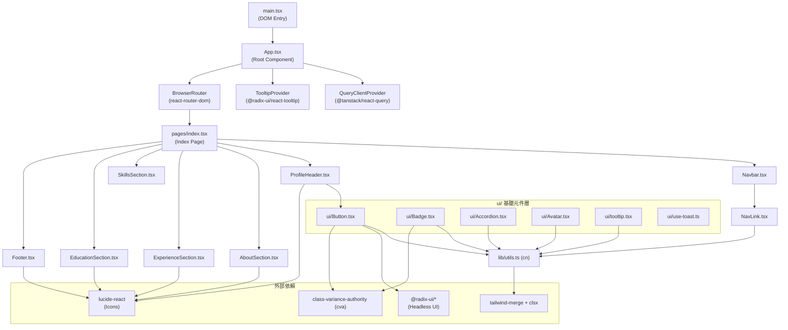

# 專案技術文件 (skill.md)

> 自動分析產出，最後更新：2026-02-22

---

## 一、src 目錄結構

```
src/
├── main.tsx                  # 應用程式真正的 DOM 掛載點（Entry Point）
├── App.tsx                   # 根元件，負責 Provider 包裹與路由設定
├── App.css                   # 全域樣式（少量）
├── index.css                 # Tailwind 指令與 CSS 變數（Design Token）
├── vite-env.d.ts             # Vite 環境型別宣告
├── assets/
│   └── react.svg
├── components/
│   ├── Navbar.tsx            # 固定頂部導覽列
│   ├── NavLink.tsx           # 封裝 react-router-dom NavLink 的通用元件
│   ├── ProfileHeader.tsx     # Hero 區塊（頭像、姓名、聯絡按鈕）
│   ├── AboutSection.tsx      # 關於我區塊
│   ├── ExperienceSection.tsx # 工作經歷區塊
│   ├── SkillsSection.tsx     # 技能列表區塊
│   ├── EducationSection.tsx  # 學歷與證照區塊
│   ├── Footer.tsx            # 頁尾聯絡資訊
│   └── ui/                   # 通用 UI 基礎元件（shadcn/ui 風格）
│       ├── Accordion.tsx
│       ├── Alert.tsx
│       ├── alert-dialog.tsx
│       ├── aspect-dialog.tsx
│       ├── Avatar.tsx
│       ├── Badge.tsx
│       ├── Button.tsx
│       ├── Toggle.tsx
│       ├── tooltip.tsx
│       └── use-toast.ts
├── lib/
│   └── utils.ts              # 全域工具函式（cn）
└── pages/
    └── index.tsx             # 首頁 Page 元件，組合所有 Section
```

---

## 二、核心 Entry Point 與最重要的 3 個 Logic 檔案

### Entry Point

| 檔案                  | 說明                                                                                                              |
| --------------------- | ----------------------------------------------------------------------------------------------------------------- |
| `src/main.tsx`        | 真正的 DOM 掛載點，使用 `createRoot` 將 `<App />` 掛載至 `#root`，並包裹 `<StrictMode>`                           |
| `src/App.tsx`         | 根元件，依序包裹 `QueryClientProvider` → `TooltipProvider` → `BrowserRouter` → `Routes`，是整個應用的 Provider 層 |
| `src/pages/index.tsx` | 唯一的 Page 元件，按照視覺順序組合所有 Section 元件                                                               |

### 最重要的 3 個 Logic 檔案

#### 1. `src/lib/utils.ts` — 核心工具函式

最被廣泛引用的工具模組，提供 `cn()` 函式，是所有 UI 元件的 className 合併基礎。

```ts
import { clsx, type ClassValue } from "clsx";
import { twMerge } from "tailwind-merge";

export function cn(...inputs: ClassValue[]) {
  return twMerge(clsx(inputs));
}
```

#### 2. `src/components/ui/Button.tsx` — 核心 UI 元件

使用 `cva`（class-variance-authority）定義多 variant 的按鈕，並透過 `@radix-ui/react-slot` 的 `asChild` 模式支援多型態渲染（如 `<a>` 標籤）。

#### 3. `src/components/ExperienceSection.tsx` — 最複雜的業務邏輯元件

定義了 `Experience` interface，使用靜態資料陣列驅動渲染，是目前資料結構最完整的 Section 元件，代表了本專案的資料組織模式。

---

## 三、組件依賴關係圖（Mermaid）



---

## 四、命名規範

### 檔案與元件命名

| 類型                   | 規範                                  | 範例                                     |
| ---------------------- | ------------------------------------- | ---------------------------------------- |
| React 元件檔案         | `PascalCase.tsx`                      | `ProfileHeader.tsx`, `SkillsSection.tsx` |
| 工具函式檔案           | `camelCase.ts`                        | `utils.ts`                               |
| Hook 檔案              | `use-kebab-case.ts`                   | `use-toast.ts`                           |
| UI 元件（shadcn 風格） | `PascalCase.tsx` 或 `kebab-case.tsx`  | `Button.tsx`, `alert-dialog.tsx`         |
| Page 元件              | 放在 `pages/` 下，以 `index.tsx` 為主 | `pages/index.tsx`                        |

### 變數與函式命名

| 類型                     | 規範             | 範例                                                  |
| ------------------------ | ---------------- | ----------------------------------------------------- |
| React 元件               | `PascalCase`     | `const ProfileHeader = () => {}`                      |
| 一般函式                 | `camelCase`      | `cn()`, `getFullYear()`                               |
| 靜態資料陣列             | `camelCase` 複數 | `experiences`, `skillCategories`, `highlights`        |
| TypeScript Interface     | `PascalCase`     | `interface Experience {}`, `interface ButtonProps {}` |
| CSS 變數（Design Token） | `--kebab-case`   | `--primary`, `--muted-foreground`                     |
| Tailwind 自訂色彩        | `kebab-case`     | `primary-foreground`, `muted`                         |

### 路徑別名

專案使用 `@/` 作為 `src/` 的路徑別名：

```ts
// ✅ 正確
import { cn } from "@/lib/utils";
import { Button } from "@/components/ui/Button";

// ❌ 避免
import { cn } from "../../lib/utils";
```

---

## 五、常用工具函式

### `cn(...inputs)` — `src/lib/utils.ts`

**最核心的工具函式**，幾乎所有 UI 元件都會使用。結合 `clsx`（條件式 className）與 `tailwind-merge`（解決 Tailwind class 衝突）。

```ts
import { cn } from "@/lib/utils";

// 基本用法
<div className={cn("base-class", isActive && "active-class")} />

// 覆蓋 Tailwind class（tailwind-merge 會自動解決衝突）
<div className={cn("px-4 py-2", className)} />
```

### `cva()` — class-variance-authority

用於定義有多個 variant 的元件樣式，搭配 `cn()` 使用：

```ts
const buttonVariants = cva("base-styles", {
  variants: {
    variant: { default: "...", secondary: "...", outline: "..." },
    size:    { default: "...", sm: "...", lg: "..." },
  },
  defaultVariants: { variant: "default", size: "default" },
});

// 使用
<button className={cn(buttonVariants({ variant, size, className }))} />
```

### `asChild` 模式 — `@radix-ui/react-slot`

`Button` 元件支援 `asChild` prop，可將樣式套用到子元素（如 `<a>`），避免巢狀 DOM 問題：

```tsx
// 渲染為 <a> 標籤，但套用 Button 樣式
<Button variant="secondary" size="sm" asChild>
  <a href="mailto:example@gmail.com">
    <Mail className="w-4 h-4" />
    Email
  </a>
</Button>
```

### `forwardRef` 模式

自訂元件（如 `NavLink`, `Button`）皆使用 `React.forwardRef` 以支援 ref 傳遞：

```ts
export const NavLink = forwardRef<HTMLAnchorElement, NavLinkCompatProps>(
  ({ className, ...props }, ref) => { ... }
);
NavLink.displayName = "NavLink";
```

---

## 六、串接 API 時的注意事項

本專案目前以**靜態資料**為主（資料直接寫在元件或模組頂層），但已預先安裝並設定好 `@tanstack/react-query`，可直接使用。

### 已設定的 API 基礎建設

```tsx
// src/App.tsx — QueryClient 已在根元件初始化
const queryClient = new QueryClient();

const App = () => (
  <QueryClientProvider client={queryClient}>{/* ... */}</QueryClientProvider>
);
```

### 新增 API 串接的建議做法

#### 1. 建立 API 函式（建議放在 `src/api/` 或 `src/services/`）

```ts
// src/api/profile.ts
export async function fetchProfile() {
  const res = await fetch("/api/profile");
  if (!res.ok) throw new Error("Failed to fetch profile");
  return res.json();
}
```

#### 2. 使用 `useQuery` 取得資料

```tsx
import { useQuery } from "@tanstack/react-query";
import { fetchProfile } from "@/api/profile";

const ProfileHeader = () => {
  const { data, isLoading, isError } = useQuery({
    queryKey: ["profile"],
    queryFn: fetchProfile,
  });

  if (isLoading) return <div>Loading...</div>;
  if (isError) return <div>Error loading profile</div>;
  // ...
};
```

#### 3. 使用 `useMutation` 處理表單送出

```tsx
import { useMutation } from "@tanstack/react-query";

const { mutate, isPending } = useMutation({
  mutationFn: (data) =>
    fetch("/api/contact", { method: "POST", body: JSON.stringify(data) }),
  onSuccess: () => {
    /* 顯示成功 toast */
  },
  onError: () => {
    /* 顯示錯誤 toast */
  },
});
```

### 注意事項

| 項目              | 說明                                                                                                                            |
| ----------------- | ------------------------------------------------------------------------------------------------------------------------------- |
| **QueryKey 命名** | 使用陣列格式，第一個元素為資源名稱，如 `["profile"]`、`["experience", id]`                                                      |
| **錯誤處理**      | API 函式應在 `!res.ok` 時主動 `throw new Error()`，讓 React Query 的 `isError` 正確觸發                                         |
| **Toast 通知**    | 專案已安裝 `sonner`，可用 `toast.success()` / `toast.error()` 顯示 API 回應結果                                                 |
| **型別安全**      | 建議為 API 回傳資料定義 TypeScript interface，並在 `useQuery<T>` 傳入泛型                                                       |
| **環境變數**      | API base URL 應存放於 `.env` 檔案，以 `VITE_` 前綴開頭（如 `VITE_API_BASE_URL`），透過 `import.meta.env.VITE_API_BASE_URL` 存取 |
| **外部連結安全**  | 所有 `target="_blank"` 的連結都應加上 `rel="noopener noreferrer"`（專案已遵循此規範）                                           |
| **路徑別名**      | 所有 import 使用 `@/` 別名，避免相對路徑混亂                                                                                    |

---

## 七、技術棧總覽

| 類別            | 技術                                             |
| --------------- | ------------------------------------------------ |
| 框架            | React 18 + TypeScript                            |
| 建置工具        | Vite 5                                           |
| 路由            | react-router-dom v6                              |
| 狀態 / 資料請求 | @tanstack/react-query v5                         |
| 樣式            | Tailwind CSS v3 + tailwindcss-animate            |
| UI 元件基礎     | Radix UI (Headless) + shadcn/ui 風格             |
| 樣式工具        | clsx + tailwind-merge + class-variance-authority |
| Icon            | lucide-react                                     |
| 表單            | react-hook-form + zod                            |
| 測試            | Vitest + @testing-library/react                  |
| Lint            | ESLint 9 + typescript-eslint                     |
